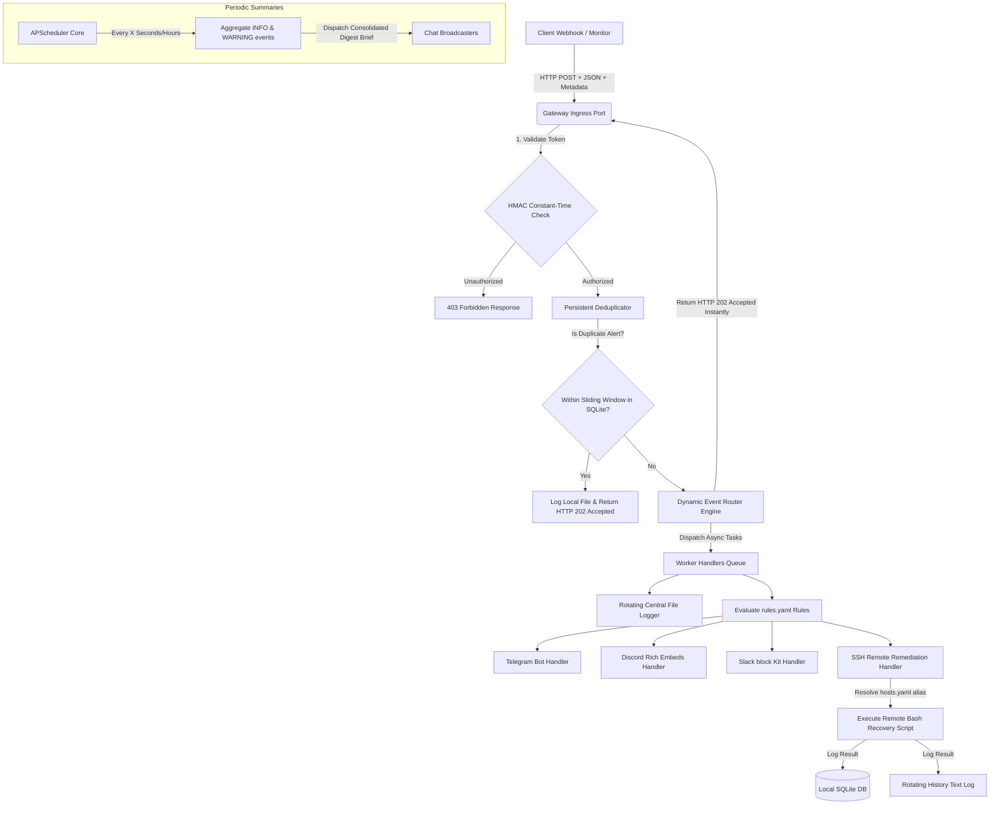

# 🛡️ **Webhook Router – Infrastructure Event Gateway**

[](https://www.python.org/)
[](LICENSE)
[]()

---

## 🏗️ Architecture Flow



---

## 🚀 Key Features

*   ⚡ **High-Performance Ingress:** Sub-millisecond HTTP `202 Accepted` response times. Webhooks are immediately acknowledged, delegating heavy operations (HTTP requests, SSH network socket actions) to non-blocking background threads via FastAPI `BackgroundTasks`.
*   🛡️ **Hardened Security:** Mitigates timing attacks using `hmac.compare_digest` for constant-time API token validations.
*   🔄 **Dynamic Rules Engine:** Evaluate routes using a customizable `rules.yaml`. Administration endpoints (`POST /rules/reload`) are fully protected and support hot-reloading rules live in-memory **with zero server downtime**.
*   ⏱️ **Scheduled Digests (Anti-Spam):** Avoid alert fatigue. Low-severity warnings (`INFO` and `WARNING`) are silently buffered by a `DigestCollector` and periodically broadcasted as a single consolidated summary using an integrated **APScheduler** cycle. Critical failures (`CRITICAL`) always trigger instantly.
*   🗃️ **Persistent Database State (SQLite):** Keeps trace of deduplication history and telemetry statistics persistently on disk in `gateway.db`, surviving gateway server updates and reboots.
*   🌐 **Decoupled Cluster Directory (`hosts.yaml`):** Maps cluster node aliases (e.g. `prod-db-01`) to network IPs and usernames on the server-side. Senders only need to supply `"ssh_host_override": "prod-db-01"`, keeping sensitive network addresses hidden from client scripts.
*   🔒 **Encrypted SSH Key Support:** Supports loading passphrase-protected SSH private keys using Pydantic environment configurations.
*   📈 **Live Statistics Endpoint (`GET /stats`):** Dedicated, secure REST endpoint querying live server uptime, processed event counts, automated remediation success ratios, and the last 5 shell execution results fetched directly from SQLite.
*   💾 **Disk Protection Log Rotation:** Uses standard Python `RotatingFileHandler` across all log outputs, capping log file size to 5MB and retaining a backup of 5 rolling history files to protect host system storage.
*   📣 **Multichannel Formatted Alerts:** Employs dedicated handlers for **Discord Webhooks** (styled sidebar severity embeds), **Slack Webhooks** (Blocks Kit), and **Telegram Bot API** (rich markdown layout) featuring **exponential backoff HTTP retries**.

---

## 📁 Repository Structure

```
webhook-router/
├── .env                  # Configuration variables (Tokens, SSH targets, Chat webhooks)
├── .env.example          # Template environment configurations
├── hosts.yaml            # Cluster registry mapping node aliases to network coordinates
├── requirements.txt      # Dependency manifests
├── rules.yaml            # Hot-reloadable user routing rules configurations
├── run.py                # Main entrypoint helper script
├── app/                  # Centralized application logic package
│   ├── main.py           # FastAPI application definition and lifespan controller
│   ├── api/              # HTTP routers division
│   │   ├── auth.py       # Identity & access management (JWT and RBAC controllers)
│   │   ├── deps.py       # FastAPI dependency injection functions
│   │   ├── gateway.py    # Webhook Ingress & simulate webhook endpoints
│   │   └── admin/        # Core admin endpoints: stats, rules, config, nodes, logs
│   ├── core/             # Configuration & DB connection management
│   │   ├── config.py     # Settings module (Pydantic Settings type check)
│   │   ├── database.py   # SQLite database engine manager (async)
│   │   └── security.py   # Cryptographic utilities (Bcrypt & JWT signing)
│   ├── models/           # ORM and API Pydantic schemas
│   │   ├── event.py      # Event and EventSeverity models
│   │   └── orm.py        # SQLAlchemy Declarative base models (Users, records, sessions)
│   ├── services/         # Core business logic processing engine
│   │   └── router_engine.py # Core EventRouter, Deduplicator, and Digest collector
│   ├── templates/        # HTML visual files
│   │   └── dashboard.html # Single Page Application web console
│   └── handlers/         # Modular background task worker implementations
│       ├── __init__.py   # Singleton registrations & handler maps
│       ├── base.py       # Abstract Base Handler specification with retrying safe_post
│       ├── logger.py     # FileLogger (Appends formatted event logs with rotation)
│       ├── telegram.py   # Telegram broadcast notifier
│       ├── discord.py    # Discord color-coded embed notifier
│       ├── slack.py      # Slack blocks layout notifier
│       └── ssh.py        # Automated SSH target command executor with SQLite logs
└── scripts/
    ├── generate_token.py # Helper to provision secure cryptographic API tokens
    └── test_interactive.py # Interactive CLI simulator tool (Menu-driven)
```

---

## 📋 Event Data Schema (`models.py`)

All monitoring webhooks must post a JSON object matching the `Event` schema:

```json
{
  "token": "my_secure_api_token",
  "source": "proxmox-hypervisor-01",
  "service": "docker-nginx",
  "severity": "CRITICAL",
  "message": "Nginx main cluster reported 502 Bad Gateway failures.",
  "timestamp": 1716012345,
  "metadata": {
    "docker_container": "nginx-proxy",
    "ssh_host_override": "prod-db-01",
    "failing_streak": 3,
    "logs": "connect() failed (111: Connection refused) while connecting to upstream"
  }
}
```

### Metadata Overrides Breakdown:
*   `docker_container`: Instructs the SSH remediator to execute a targeted `docker restart <container>` command.
*   `remediation_cmd`: Replaces default script mapping with a custom execution command (e.g. `systemctl restart nginx`).
*   `ssh_host_override`: Dynamically routes SSH commands. Can either be a direct IP/Domain address, or a node alias defined securely inside `hosts.yaml` (e.g. `prod-db-01`).
*   `logs`: Embeds service log printouts directly inside Slack, Discord, and Telegram messages.

---

## 🌐 Dynamic Host Registry Config (`hosts.yaml`)

Decouple client webhooks from server infrastructure coordinates. The gateway securely resolves aliases at runtime:

```yaml
hosts:
  prod-db-01:
    host: "192.168.1.50"
    port: 22
    username: "deploy-admin"

  prod-web-02:
    host: "192.168.1.60"
    port: 22
    username: "ubuntu"
```

---

## 🚀 Quick Start Guide (One-Click Setup)

You can initialize the entire environment, configure a secure cryptographic `.env` token, and run the server by executing **just one single command**:

### The Easy Way: All-In-One Bootstrappers
*   **On Windows (PowerShell):**
    ```powershell
    .\setup.ps1
    ```
*   **On Linux / macOS (Bash):**
    ```bash
    chmod +x setup.sh
    ./setup.sh
    ```
These bootstrapper scripts will automatically handle Python path detection, create the `venv` virtual environment, install all required packages, create a default `hosts.yaml` clúster config, auto-generate a secure token for `.env` and offer to run the server.

---

### The Manual Way: Step-by-Step

#### 1. Set Up Environment & Dependencies
Create a Python virtual environment and install the required modules:
```bash
python -m venv venv
# On Linux/macOS
source venv/bin/activate
# On Windows PowerShell
.\venv\Scripts\Activate.ps1

pip install -r requirements.txt
```

#### 2. Generate a Secure API Access Key
Provision a secure token for environment variables and webhooks:
```bash
python scripts/generate_token.py
```
Copy the token.

#### 3. Configure Settings (`.env`)
Create a local `.env` file using `.env.example` as a template and paste the key:
```env
GATEWAY_TOKEN=your_secure_generated_token_here

# Telegram, Slack, or Discord URLs (Leave blank to operate in console Simulation mode)
TELEGRAM_BOT_TOKEN=
TELEGRAM_CHAT_ID=
DISCORD_WEBHOOK_URL=
SLACK_WEBHOOK_URL=

# Global default SSH targets for remediation tasks
SSH_HOST=127.0.0.1
SSH_PORT=22
SSH_USERNAME=admin
SSH_PASSWORD=
SSH_PRIVATE_KEY_PATH=
SSH_PRIVATE_KEY_PASSPHRASE=

# Core timers
DEDUPLICATION_WINDOW_SECONDS=300
DIGEST_INTERVAL_SECONDS=3600
```

### 4. Startup the Gateway Server
Launch the ASGI FastAPI server using python runner or Uvicorn:
```bash
python run.py
# or
uvicorn app.main:app --host 0.0.0.0 --port 8000 --reload
```
Upon startup, the server automatically boots up `data/gateway.db` SQLite storage.

### 5. Launch the Interactive CLI Alert Simulator
In another terminal instance, execute the dynamic simulator tool to verify all features:
```bash
python scripts/test_interactive.py
```
Use the menu options to:
*   Dispatch silent informational telemetry logs.
*   Buffer warnings inside the periodic summary digest cache.
*   Simulate critical outages and inspect automated Paramiko SSH connections.
*   **Construct a Custom Event:** Interactively configure custom servers, container targets, custom commands, and logs overrides.
*   **Query Server Live Statistics:** Contact the `/stats` endpoint to print real-time processed event counters, uptime, and SQLite SSH remediation history logs.
*   Trigger an authenticated hot-reload of active routing rules.
